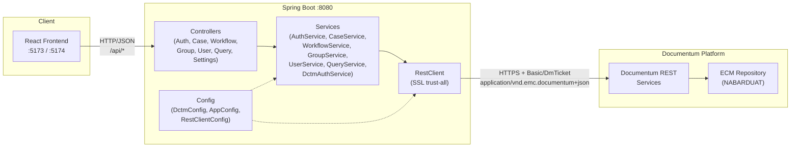
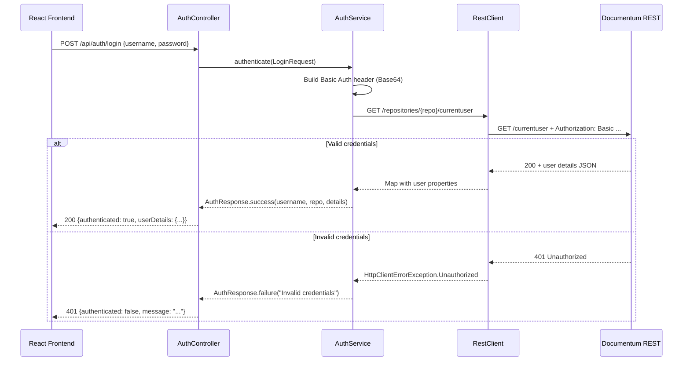
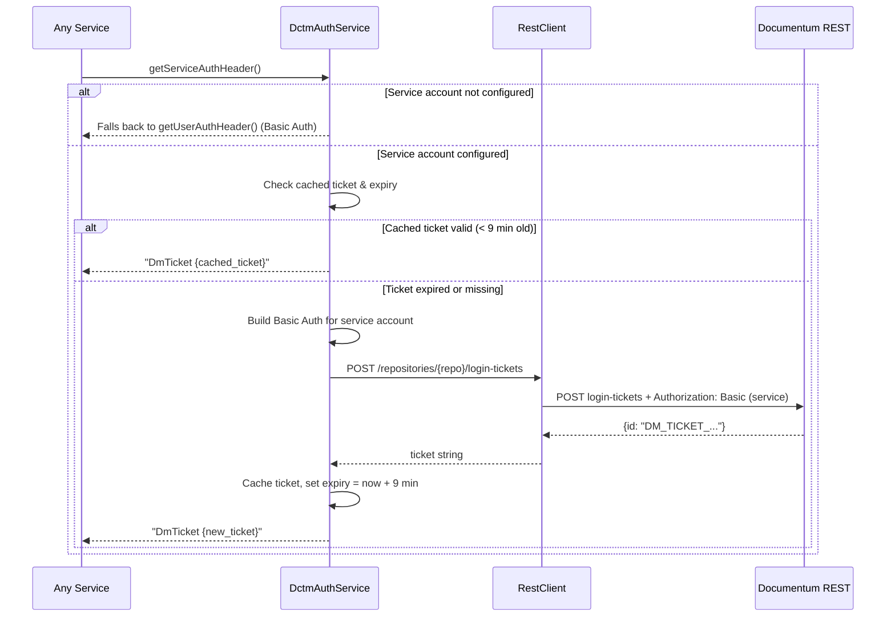
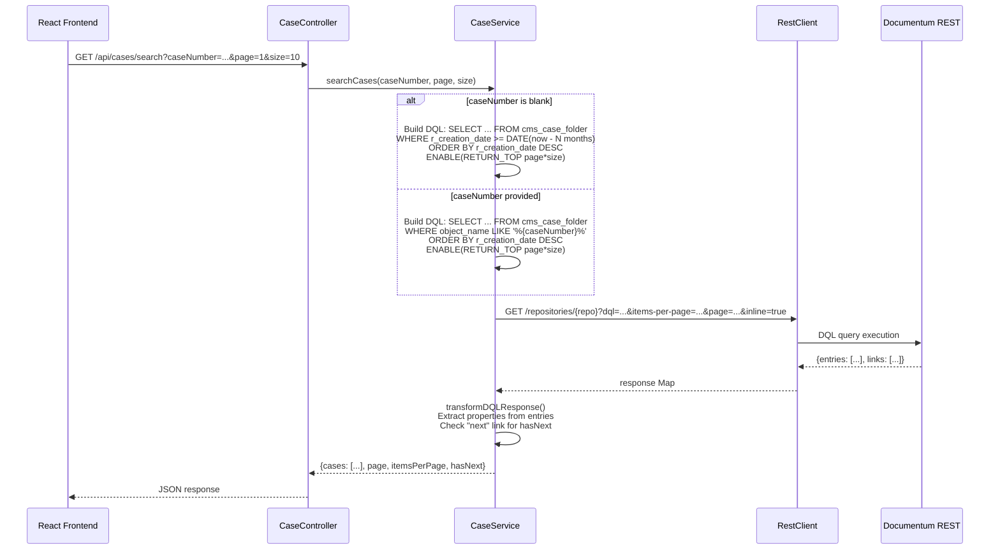
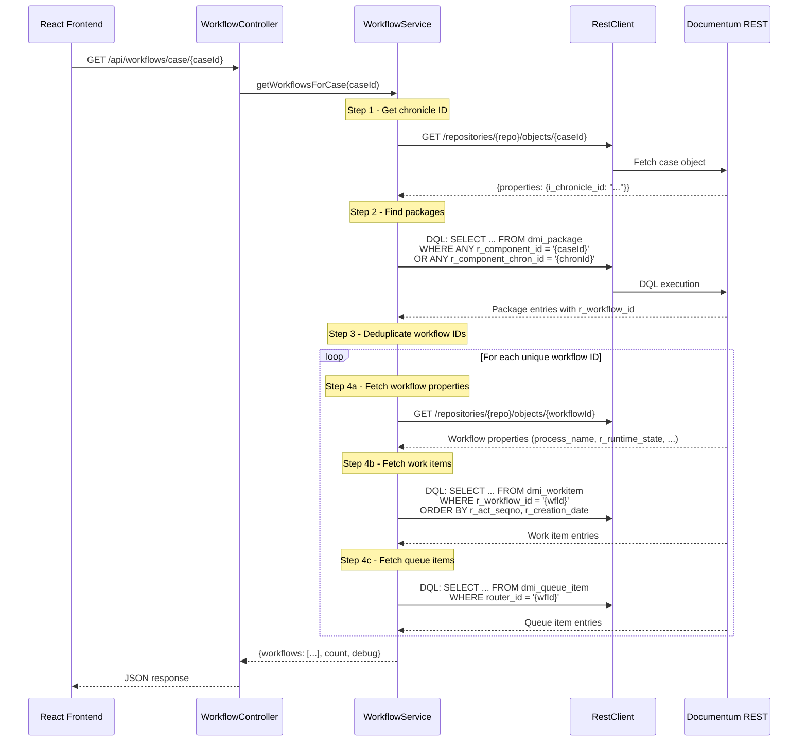

# NBSupportApp — Backend Architecture

## 1. Overview

NBSupportApp is a **support operations tool** for NABARD, built to manage cases, workflows, users, and groups stored in an **OpenText Documentum** ECM repository. The backend acts as a lightweight API gateway between the React frontend and the Documentum REST Services layer.

| Aspect | Detail |
|--------|--------|
| **Framework** | Spring Boot 3.4.1 |
| **Language** | Java 17 |
| **Build** | Maven (spring-boot-starter-parent 3.4.1) |
| **Key starters** | `spring-boot-starter-web`, `spring-boot-starter-validation`, `spring-boot-starter-actuator` |
| **Utilities** | Lombok (compile-time annotation processing) |
| **ECM integration** | Documentum REST Services (HTTP/JSON, DQL queries) |
| **Auth model** | HTTP Basic Auth forwarded to Documentum; service-account login-ticket cache for privileged ops |

---

## 2. Architecture Diagram



---

## 3. Project Structure

```
backend/
 pom.xml
 src/main/
  resources/
   application.properties            # All externalized config
  java/com/example/backend/
   BackendApplication.java            # @SpringBootApplication entry point
   config/
    AppConfig.java                    # app.cases.*, app.workflow.* properties
    DctmConfig.java                   # dctm.rest.* connection properties
    RestClientConfig.java             # RestClient.Builder bean with SSL bypass
   controller/
    AuthController.java               # Login, login-ticket generation, current user, user list
    CaseController.java               # Case search (cms_case_folder)
    WorkflowController.java           # Process templates, running instances, case workflows, restart/retry
    GroupController.java              # Group CRUD, member management
    UserController.java               # User profile search & update (cms_user_profile)
    QueryController.java              # Ad-hoc DQL execution
    SettingsController.java           # Expose app settings to frontend
   dto/
    LoginRequest.java                 # username, password, repository (validated)
    AuthResponse.java                 # authenticated flag, user details, message
   service/
    AuthService.java                  # Validates credentials against Documentum /currentuser
    DctmAuthService.java              # Basic Auth headers, service-account login-ticket cache
    CaseService.java                  # DQL-based case search with date filtering
    WorkflowService.java              # Workflow resolution (packages -> workflows -> workitems)
    GroupService.java                 # Group search, detail, member add/remove via REST + DQL
    UserService.java                  # User profile search, update, dm_user status sync
    QueryService.java                 # Generic DQL executor with auto-column injection & pagination
```

---

## 4. API Endpoints

### AuthController (`/api/auth`)

| Method | Path | Description |
|--------|------|-------------|
| `POST` | `/api/auth/login` | Authenticate user against Documentum; returns `AuthResponse` |
| `GET` | `/api/auth/login-ticket` | Generate login ticket for the configured default user |
| `GET` | `/api/auth/login-ticket/{username}` | Generate login ticket for a specific user (impersonation) |
| `GET` | `/api/auth/current-user` | Return configured username, repository, service-account status |
| `GET` | `/api/auth/users` | List all active `dm_user` records (up to 1000) |

### CaseController (`/api/cases`)

| Method | Path | Description |
|--------|------|-------------|
| `GET` | `/api/cases/search` | Search `cms_case_folder` by case number; defaults to last N months. Params: `caseNumber`, `page`, `size` |

### WorkflowController (`/api/workflows`)

| Method | Path | Description |
|--------|------|-------------|
| `GET` | `/api/workflows/processes` | List configured process templates from `app.workflow.processes` |
| `GET` | `/api/workflows/instances` | Get running workflow instances filtered by `processName` (template ID). Params: `page`, `size` |
| `GET` | `/api/workflows/case/{caseId}` | Resolve all workflows linked to a case via `dmi_package` |
| `POST` | `/api/workflows/{workflowId}/restart` | Restart a workflow (privileged, uses service account) |
| `POST` | `/api/workflows/{workflowId}/activity/{activityId}/retry` | Retry a failed activity (privileged, uses service account) |

### GroupController (`/api/groups`)

| Method | Path | Description |
|--------|------|-------------|
| `GET` | `/api/groups/search` | Search groups via REST `/groups` endpoint. Params: `groupName`, `page`, `size` |
| `GET` | `/api/groups/{groupName}` | Get group properties and available HATEOAS actions |
| `GET` | `/api/groups/{groupName}/members` | List user and group members of a group |
| `POST` | `/api/groups/{groupName}/members` | Add a user or group member. Body: `{memberName, memberType, memberSrc}` |
| `DELETE` | `/api/groups/{groupName}/members/{memberName}` | Remove a member. Param: `memberType` |
| `GET` | `/api/groups/search-members` | Search for users/groups to add. Params: `query`, `type` |

### UserController (`/api/users`)

| Method | Path | Description |
|--------|------|-------------|
| `GET` | `/api/users/profiles` | Search `cms_user_profile` by name, UIN, login, department, or designation. Params: `query`, `page`, `size` |
| `PATCH` | `/api/users/profiles/{objectId}` | Update user profile properties (whitelisted fields only); syncs `dm_user.user_state` if `is_active` changes |

### QueryController (`/api/query`)

| Method | Path | Description |
|--------|------|-------------|
| `POST` | `/api/query/execute` | Execute arbitrary DQL. Body: `{dql, limit}`. Auto-injects `r_object_id`, respects `RETURN_TOP` hints |

### SettingsController (`/api/settings`)

| Method | Path | Description |
|--------|------|-------------|
| `GET` | `/api/settings` | Return `app.cases.defaultLoadMonths` (and future settings) to the frontend |

---

## 5. Authentication Flow



**Key points:**

- Credentials are forwarded as HTTP Basic Auth to Documentum's `/currentuser` endpoint.
- The repository defaults to `dctm.rest.repository` if not provided in the request.
- User privilege level (`user_privileges == 16` = SUPERUSER) is checked when listing users.

---

## 6. Service Account & Login Ticket Flow



**Key points:**

- Login tickets from Documentum typically expire in **10 minutes**.
- The cache TTL is set to **9 minutes** to provide a safety margin.
- If ticket acquisition fails, the service falls back to Basic Auth.
- `executeAsService()` provides an audit-logged wrapper for privileged operations.
- `clearServiceTicketCache()` allows forced cache invalidation.

---

## 7. Case Search Flow



**Key points:**

- Single DQL query fetches all required fields, avoiding N+1 query problems.
- `app.cases.default-load-months` (default: 3) controls the date window for default loads.
- Pagination uses Documentum REST's `items-per-page` and `page` parameters.
- `ENABLE(RETURN_TOP n)` is a DQL hint limiting results at the database level.

---

## 8. Workflow Resolution Flow



**Key points:**

- Resolution chain: **Case** -> `i_chronicle_id` -> **dmi_package** -> `r_workflow_id` -> **dm_workflow** -> **dmi_workitem** + **dmi_queue_item**.
- Null workflow IDs (`0000000000000000`) are filtered out.
- Each workflow result includes its properties, work items (activity history), and queue items (current inbox state).
- Debug logs are included in the response to aid troubleshooting.
- `restart` and `retry` operations use the service account (elevated privileges).

---

## 9. Configuration

All configuration lives in `application.properties`.

### Documentum REST Connection (`dctm.rest.*`)

| Property | Description | Default / Example |
|----------|-------------|-------------------|
| `dctm.rest.url` | Base URL of Documentum REST Services | `https://172.172.20.214:3030/dctm-rest` |
| `dctm.rest.repository` | Default Documentum repository name | `NABARDUAT` |
| `dctm.rest.username` | Regular user for standard operations | `dmadmin` |
| `dctm.rest.password` | Regular user password | *(configured)* |
| `dctm.rest.service-username` | Privileged service account (SUPERUSER) | `${DCTM_SERVICE_USERNAME:dmadmin}` |
| `dctm.rest.service-password` | Service account password | `${DCTM_SERVICE_PASSWORD:...}` |

### Application Settings (`app.*`)

| Property | Description | Default |
|----------|-------------|---------|
| `app.cases.default-load-months` | Months of case history to load when no search term is given | `3` |
| `app.workflow.processes` | Comma-separated list of process template IDs (r_object_id of dm_process) | `4b02cba08000624a` |

### Spring Boot

| Property | Description |
|----------|-------------|
| `spring.application.name` | `backend` |

---

## 10. Documentum Object Types

| Object Type | Purpose | Key Fields |
|-------------|---------|------------|
| `cms_case_folder` | Case folder (custom type) | `object_name` (case number), `subject`, `ho_ro`, `description`, `department_name`, `functions`, `r_creation_date` |
| `cms_user_profile` | Custom user profile | `object_name`, `uin`, `department_name`, `user_grade`, `designation`, `user_email_address`, `user_login_name`, `primary_mobile_number`, `location`, `office_type`, `is_active`, `hindi_user_name`, `hindi_designation`, `user_role` |
| `dm_user` | Built-in Documentum user | `user_name`, `user_address`, `user_privileges`, `user_state` (0=active, 1=inactive) |
| `dm_group` | Built-in Documentum group | `group_name`, `description`, `owner_name`, `users_names`, `groups_names` |
| `dm_workflow` | Workflow runtime instance | `process_name`, `r_runtime_state`, `r_object_id` |
| `dm_process` | Workflow process template | `object_name`, `r_object_id` (used as process template ID) |
| `dmi_package` | Workflow package (links documents to workflows) | `r_workflow_id`, `r_package_name`, `r_component_id` (repeating), `r_component_chron_id` (repeating) |
| `dmi_workitem` | Workflow activity instance | `r_workflow_id`, `r_act_seqno`, `r_runtime_state`, `r_performer_name`, `r_creation_date`, `r_act_def_id`, `a_wq_name` |
| `dmi_queue_item` | User inbox queue entry | `name`, `task_state`, `sent_by`, `date_sent`, `item_id`, `router_id` |

---

## 11. Error Handling Patterns

The backend follows a consistent, service-level error handling approach:

### Pattern: Return-map with success/error fields

Services that perform mutations (GroupService, WorkflowService, AuthController login-ticket) return a `Map<String, Object>` with:

```java
// Success
result.put("success", true);
result.put("message", "Operation completed successfully");

// Failure
result.put("success", false);
result.put("error", "Failed to ...: " + e.getMessage());
```

### Pattern: Exception propagation for read operations

Read-oriented services (CaseService, QueryService) catch exceptions and either:

1. **Wrap in RuntimeException** -- the controller lets Spring's default error handler return a 500.
2. **Return an error map** -- includes an `error` key alongside empty data collections so the frontend can still render.

```java
// CaseService, QueryService error return
errorResult.put("cases", new ArrayList<>());
errorResult.put("error", "Failed to search cases: " + e.getMessage());
```

### Pattern: Graceful degradation

- **DctmAuthService**: If service-account ticket acquisition fails, it falls back to Basic Auth rather than throwing.
- **WorkflowService**: Each sub-step (workflow props, work items, queue items) is independently try-caught; partial results are still returned.
- **UserService.syncDmUserStatus()**: If the `dm_user` status sync fails, the profile update still proceeds.

### Logging

All services use `@Slf4j` (Lombok) with structured log messages:
- `log.info()` for successful operations and key milestones.
- `log.warn()` for recoverable issues (e.g., fallback to Basic Auth).
- `log.error()` for failures, always including the exception message and often the stack trace.

---

## 12. Security Notes

### SSL Bypass

`RestClientConfig` installs a **trust-all** `SSLSocketFactory` and a permissive `HostnameVerifier`. This disables TLS certificate validation for all outbound HTTP calls to Documentum REST.

```
TrustAllRequestFactory -> SSLContext("TLS") with no-op TrustManager
```

> **Production warning**: This is suitable for development or environments with self-signed certificates only. For production, configure a proper truststore with the Documentum server's CA certificate.

### CORS

All controllers use `@CrossOrigin` allowing origins `http://localhost:5173` and `http://localhost:5174` (Vite dev server ports). `SettingsController` only allows `:5173`.

> **Production note**: These should be replaced with the actual production frontend origin(s) or a global CORS configuration bean.

### Constructor Injection

All services and controllers use **constructor injection** (either explicit constructors or Lombok's `@RequiredArgsConstructor`), which makes dependencies explicit, immutable after construction, and testable. No field-level `@Autowired` is used.

### Credential Handling

- Regular user credentials (`dctm.rest.username` / `dctm.rest.password`) are stored in `application.properties` in plain text. In production, these should be externalized via environment variables, Vault, or Spring Cloud Config.
- Service account credentials support environment variable substitution: `${DCTM_SERVICE_USERNAME:default}`.
- Login tickets are cached in memory (`DctmAuthService`) -- not persisted or shared across instances.

### Input Sanitization

- SQL injection protection: Single quotes are escaped (`replace("'", "''")`) in DQL string interpolation (CaseService, AuthController).
- User profile updates use a whitelist of allowed property names to prevent arbitrary field modification.
- `QueryController` allows execution of arbitrary DQL, which should be restricted to authorized support users in a production deployment.
