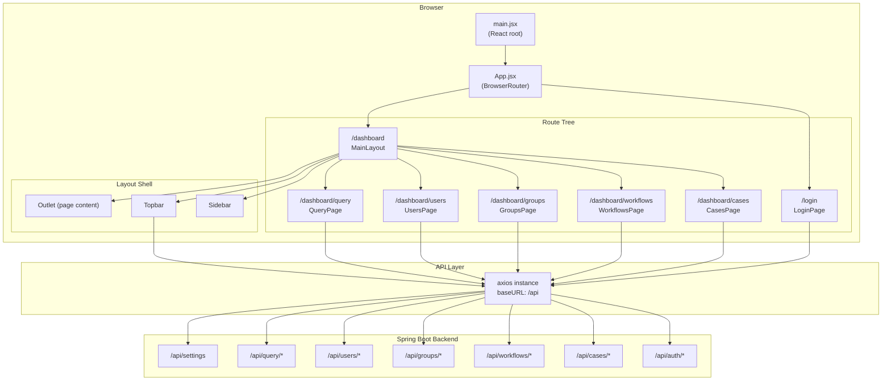
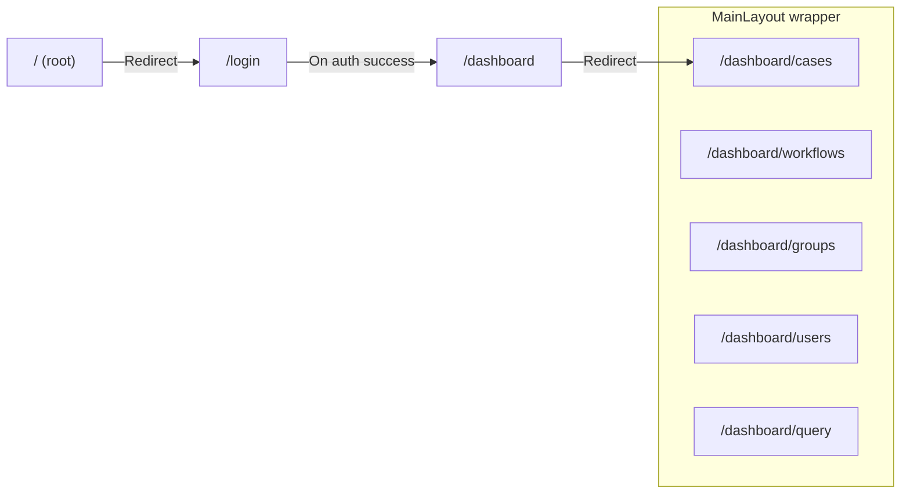
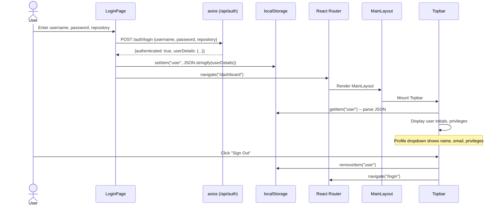
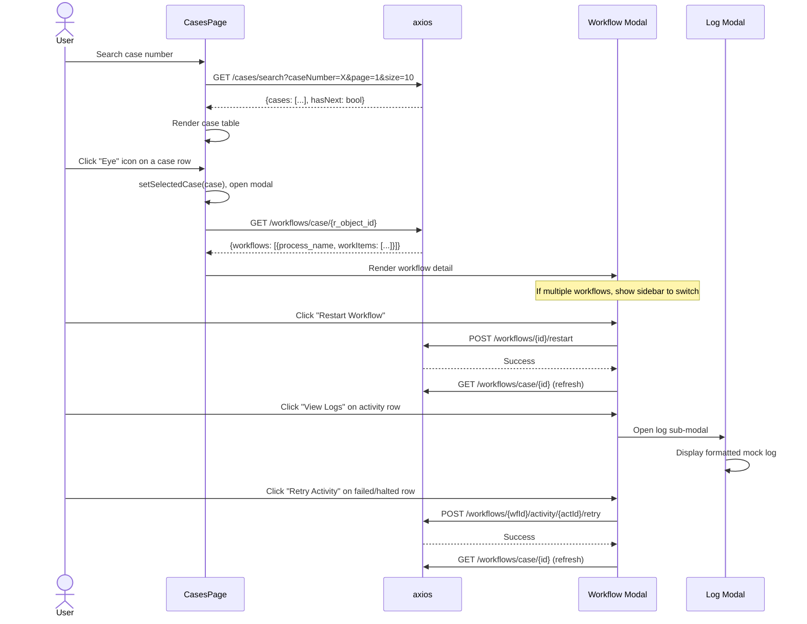
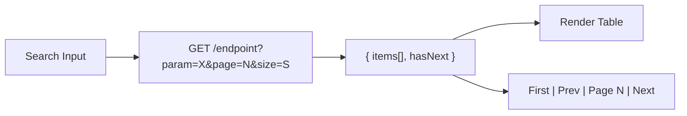

# NBSupportApp -- Frontend Architecture

## 1. Overview

NBSupportApp is an enterprise support-desk frontend for managing Documentum ECM cases, workflows, groups, and users. It is built on the following stack:

| Layer | Technology | Version |
|---|---|---|
| UI Framework | React | 19.2 |
| Build Tool | Vite | 7.2 |
| CSS Framework | Tailwind CSS | 3.4 |
| Routing | React Router DOM | 7.13 |
| HTTP Client | axios | 1.13 |
| Animation | framer-motion | 12.29 |
| Icons | lucide-react | 0.563 |

The frontend communicates with a Spring Boot backend at `http://localhost:8080/api` and persists minimal client state in `localStorage` (authenticated user session, query history).

---

## 2. Application Architecture



---

## 3. Project Structure

```
frontend/
  index.html                      # HTML entry point (title: "NB ECM")
  vite.config.js                  # Vite config -- React plugin
  tailwind.config.js              # Tailwind config -- Inter font, brand palette
  package.json                    # Dependencies & scripts
  src/
    main.jsx                      # React 19 createRoot, StrictMode
    App.jsx                       # BrowserRouter, route definitions
    App.css                       # Legacy Vite scaffold styles (unused)
    index.css                     # Tailwind directives, Inter import, scrollbar styles
    api/
      axios.js                    # Shared axios instance (baseURL, JSON headers)
    hooks/
      useQueryHistory.js          # Custom hook -- localStorage query history
    components/
      layout/
        MainLayout.jsx            # Dashboard shell (Sidebar + Topbar + Outlet)
        Sidebar.jsx               # Left nav with NavLink items
        Topbar.jsx                # Top bar -- profile dropdown, login ticket generator
      EditUserProfileModal.jsx    # Modal form for editing user profile fields
      ManageMembersModal.jsx      # Two-panel modal for group membership management
    pages/
      LoginPage.jsx               # Split-screen login with framer-motion
      CasesPage.jsx               # Case search, table, workflow detail modal
      WorkflowsPage.jsx           # Process selector + workflow instance grid
      GroupsPage.jsx              # Group search, table, ManageMembersModal trigger
      UsersPage.jsx               # User directory with client-side sort/filter
      QueryPage.jsx               # DQL query editor with history & column filters
```

---

## 4. Routing Architecture



### Route Table

| Path | Component | Layout | Description |
|---|---|---|---|
| `/` | `Navigate` | -- | Redirects to `/login` |
| `/login` | `LoginPage` | None (standalone) | Authentication form |
| `/dashboard` | `MainLayout` | Sidebar + Topbar | Layout wrapper with `<Outlet>` |
| `/dashboard` (index) | `Navigate` | MainLayout | Redirects to `/dashboard/cases` |
| `/dashboard/cases` | `CasesPage` | MainLayout | Case search & workflow inspection |
| `/dashboard/workflows` | `WorkflowsPage` | MainLayout | Workflow instance browser |
| `/dashboard/groups` | `GroupsPage` | MainLayout | Group management |
| `/dashboard/users` | `UsersPage` | MainLayout | User directory & profile editing |
| `/dashboard/query` | `QueryPage` | MainLayout | DQL query console |

---

## 5. Authentication Flow



**Key details:**
- Credentials are sent as `{username, password, repository}` where repository defaults to `"NABARDUAT"`.
- On success, the server returns `userDetails` containing `properties.user_name`, `properties.user_address`, and `properties.user_privileges`.
- The Topbar reads `localStorage("user")` on mount and conditionally renders (`if (!user) return null`).
- There is no token-based auth interceptor -- the session is server-managed.

---

## 6. Page Components

### 6.1 LoginPage

**File:** `src/pages/LoginPage.jsx`

| Aspect | Detail |
|---|---|
| Layout | Split screen -- left brand panel (blue `#0A66C2`), right form (white card on `#F8F9FA`) |
| Animation | `framer-motion` fade-in + slide-up on the form card |
| State | `formData {username, password, repository}`, `isLoading`, `error` |
| API Calls | `POST /auth/login` |
| Features | Remember-me checkbox (UI only), forgot password link, error toast, loading spinner |

### 6.2 CasesPage

**File:** `src/pages/CasesPage.jsx`

| Aspect | Detail |
|---|---|
| Purpose | Search cases by case number, view workflow details for a case |
| State | `cases[]`, `page`, `pageSize`, `hasNextPage`, `totalEstimate`, `caseNumber` (input), `activeSearch`, `isDefaultLoad` |
| API Calls | `GET /cases/search?caseNumber=&page=&size=`, `GET /settings`, `GET /workflows/case/{objectId}`, `POST /workflows/{id}/restart`, `POST /workflows/{id}/activity/{actId}/retry` |
| Search | Server-side search with pagination. Default load (empty search) shows recent cases. |
| Modals | **Workflow Detail Modal** -- full-screen overlay with sidebar for multiple workflows, activity table with restart/retry actions, log viewer sub-modal |
| Pagination | Server-side cursor-based (`hasNext` flag). Page-size selector: 5, 10, 25, 50. |
| Status Badges | Maps numeric Documentum runtime states (0-5) to colored pill badges (Running, Halted, Failed, Finished, Terminated) |

### 6.3 WorkflowsPage

**File:** `src/pages/WorkflowsPage.jsx`

| Aspect | Detail |
|---|---|
| Purpose | Browse workflow instances filtered by process definition |
| State | `processes[]`, `selectedProcess`, `workflows[]`, `page`, `pageSize`, `hasNextPage`, `hasPrevPage`, `totalEstimate` |
| API Calls | `GET /workflows/processes`, `GET /workflows/instances?processName=&page=&size=` |
| Data Parsing | Expects Documentum REST structure: `response.data.entries[].content.properties` |
| Pagination | Server-side via `links[]` array (`rel: 'next'`). Page-size selector: 5, 10, 25, 50. |
| Features | Process dropdown filter, skeleton loading rows, status badge mapping |

### 6.4 GroupsPage

**File:** `src/pages/GroupsPage.jsx`

| Aspect | Detail |
|---|---|
| Purpose | Search and manage Documentum groups and their members |
| State | `groups[]`, `page`, `pageSize`, `hasNextPage`, `totalEstimate`, `groupName` (input), `selectedGroup`, `isModalOpen` |
| API Calls | `GET /groups/search?groupName=&page=&size=` |
| Pagination | Server-side (`hasNext` flag). Auto-loads all groups on mount. |
| Features | Member count display (users + nested groups), "Manage" button per row opens `ManageMembersModal` |

### 6.5 UsersPage

**File:** `src/pages/UsersPage.jsx`

| Aspect | Detail |
|---|---|
| Purpose | Full user directory with client-side filtering and sorting |
| State | `allUsers[]` (full dataset), `currentPage`, `pageSize` (fixed 15), `searchQuery`, `sortConfig {key, direction}`, `selectedUser`, `isEditModalOpen` |
| API Calls | `GET /users/profiles?page=1&size=2000` (fetches all users at once) |
| Pagination | **Client-side** -- data sliced from the in-memory array |
| Sort | Client-side multi-column sort (Name, UIN, Department, Grade, Designation) via `useMemo`. Click column headers to toggle `asc`/`desc`. |
| Filter | Client-side instant filter across name, login_name, UIN, department, designation |
| Features | Total count badge, `SortableHeader` sub-component, Edit button per row opens `EditUserProfileModal` |

### 6.6 QueryPage

**File:** `src/pages/QueryPage.jsx`

| Aspect | Detail |
|---|---|
| Purpose | Execute arbitrary DQL queries against the Documentum repository |
| State | `allRows[]`, `columns[]`, `query` (textarea), `activeQuery`, `resultLimit`, `columnFilters{}`, `currentPage`, `pageSize` |
| API Calls | `POST /query/execute {dql, limit}` |
| Custom Hook | `useQueryHistory` -- stores up to 25 queries in `localStorage` with deduplication |
| Pagination | **Client-side** -- all rows fetched, then paginated in-browser |
| Column Filters | Per-column text filter inputs in the table header, applied client-side via `useMemo` |
| Features | Selective execution (highlight text + Ctrl/Cmd+Enter), query history dropdown with copy/load, configurable `RETURN_TOP` limit (100-10000), monospace textarea, keyboard shortcut |

---

## 7. Layout Components

### 7.1 MainLayout

**File:** `src/components/layout/MainLayout.jsx`

- Composes `Sidebar`, `Topbar`, and an `<Outlet>` for page content.
- Fixed sidebar (w-64 / 256px) on the left, fixed topbar (h-16 / 64px) at the top.
- Main content area has `pl-64 pt-16` to avoid overlap.
- Content constrained to `max-w-7xl` centered.

### 7.2 Sidebar

**File:** `src/components/layout/Sidebar.jsx`

- Fixed left sidebar (`w-64`, full height, `z-20`).
- Logo section: blue icon with "NB Support" title.
- Navigation items defined as a data array:

| Label | Path | Icon |
|---|---|---|
| Cases | `/dashboard/cases` | `Briefcase` |
| Workflows | `/dashboard/workflows` | `GitBranch` |
| Groups | `/dashboard/groups` | `UsersRound` |
| Users | `/dashboard/users` | `Users` |
| Query | `/dashboard/query` | `Database` |

- Uses `NavLink` with `isActive` render prop for active state styling (blue-50 bg, blue text).
- Footer: Settings button (non-functional placeholder).

### 7.3 Topbar

**File:** `src/components/layout/Topbar.jsx`

- Fixed top header bar spanning `left-64` to right edge, `z-10`.
- **Login Ticket Generator:** Dropdown to select a user and generate a temporary authentication ticket via `GET /auth/login-ticket/{username}`. Copies to clipboard.
- **Profile Section:** Avatar initials, dropdown showing user name, email, privileges (Superuser/Standard), active status, and Sign Out button.
- Reads user session from `localStorage` on mount.
- Uses `useRef` + `mousedown` listener for outside-click dropdown dismissal.

---

## 8. Component Interaction -- CasesPage Workflow Modal



---

## 9. State Management

The application uses **React-local state only** -- no external state management library (no Redux, Zustand, or Context API).

| Pattern | Usage |
|---|---|
| `useState` | All component-level state (form data, lists, loading flags, modals, pagination) |
| `useEffect` | Data fetching on mount, dependent fetches, click-outside listeners |
| `useCallback` | Memoized fetch functions (CasesPage, GroupsPage, QueryPage) |
| `useMemo` | Derived/filtered data (UsersPage sort/filter, QueryPage column filters & pagination) |
| `useRef` | DOM refs for dropdowns (outside-click), textarea (selection tracking) |
| `useNavigate` | Programmatic navigation (login redirect, logout) |
| `localStorage` | User session (`"user"` key) and query history (`"queryHistory"` key) |

### Custom Hooks

**`useQueryHistory`** (`src/hooks/useQueryHistory.js`)
- Persists up to 25 query entries in `localStorage` under key `"queryHistory"`.
- Each entry: `{id: timestamp, query: string, executedAt: timestamp, limit: number}`.
- Provides `addQuery(query, limit)` with deduplication (moves existing to top), `clearHistory()`, `removeQuery(id)`.
- Loaded on mount via `useEffect`, saved on every mutation.

---

## 10. API Integration

### Axios Configuration

**File:** `src/api/axios.js`

```js
const api = axios.create({
  baseURL: "http://localhost:8080/api",
  headers: { "Content-Type": "application/json" }
});
```

No request/response interceptors. No auth token injection. The backend manages session state.

### Complete API Call Table

| Page/Component | Method | Endpoint | Parameters | Purpose |
|---|---|---|---|---|
| LoginPage | POST | `/auth/login` | `{username, password, repository}` | Authenticate user |
| Topbar | GET | `/auth/current-user` | -- | Fetch current session user |
| Topbar | GET | `/auth/users` | -- | List all users (for login ticket) |
| Topbar | GET | `/auth/login-ticket/{username}` | -- | Generate login ticket for user |
| CasesPage | GET | `/cases/search` | `?caseNumber=&page=&size=` | Search/list cases |
| CasesPage | GET | `/settings` | -- | Fetch app settings (default load months) |
| CasesPage | GET | `/workflows/case/{objectId}` | -- | Get workflows for a case |
| CasesPage | POST | `/workflows/{id}/restart` | -- | Restart a workflow |
| CasesPage | POST | `/workflows/{id}/activity/{actId}/retry` | -- | Retry a failed activity |
| WorkflowsPage | GET | `/workflows/processes` | -- | List process definitions |
| WorkflowsPage | GET | `/workflows/instances` | `?processName=&page=&size=` | List workflow instances |
| GroupsPage | GET | `/groups/search` | `?groupName=&page=&size=` | Search/list groups |
| ManageMembersModal | GET | `/groups/{name}/members` | -- | Get group members (users + groups) |
| ManageMembersModal | GET | `/groups/search-members` | `?query=&type=` | Search users/groups to add |
| ManageMembersModal | POST | `/groups/{name}/members` | `{memberName, memberType, memberSrc}` | Add member to group |
| ManageMembersModal | DELETE | `/groups/{name}/members/{memberName}` | `?memberType=` | Remove member from group |
| UsersPage | GET | `/users/profiles` | `?page=1&size=2000` | Fetch all user profiles |
| EditUserProfileModal | PATCH | `/users/profiles/{objectId}` | `{object_name, uin, ...}` | Update user profile fields |
| QueryPage | POST | `/query/execute` | `{dql, limit}` | Execute DQL query |

---

## 11. Styling & Design System

### Color Palette

| Token | Hex | Usage |
|---|---|---|
| Primary Blue | `#0A66C2` | Buttons, active nav, logos, links, focus rings |
| Primary Blue (hover) | `#094d92` | Button hover state |
| Facebook Blue | `#1877F2` | Login button specifically |
| Slate-50 | `#f8fafc` | Page background |
| Slate-900 | `#0f172a` | Primary text |
| Brand scale | `#eff6ff` to `#1e3a8a` | Extended palette in `tailwind.config.js` (unused directly) |
| Green | `bg-green-100` / `text-green-800` | Success states, running badges |
| Red | `bg-red-100` / `text-red-800` | Error states, failed badges |
| Yellow | `bg-yellow-100` / `text-yellow-800` | Warning states, halted badges |

### Typography

- **Primary Font:** Inter (loaded via Google Fonts CDN, weights 300-700).
- **Monospace:** System default (`font-mono` Tailwind class) for IDs, code, DQL editor.
- Base font set in `index.css` on `:root` and extended in `tailwind.config.js` as `fontFamily.sans`.

### Component Patterns

- **Cards/Panels:** `bg-white border border-slate-200 rounded-xl shadow-sm`.
- **Buttons (primary):** `bg-[#0A66C2] text-white rounded-lg text-sm font-medium hover:bg-[#094d92]`.
- **Inputs:** `border border-slate-200 rounded-lg text-sm focus:outline-none focus:ring-2 focus:ring-blue-500/20 focus:border-[#0A66C2]`.
- **Tables:** Slate-50 header, `divide-y divide-slate-100` body, `hover:bg-blue-50/30` rows.
- **Badges:** `inline-flex items-center gap-1 px-2.5 py-0.5 rounded-full text-xs font-medium` with status-specific colors.
- **Skeleton Loading:** `animate-pulse` with `bg-slate-100 rounded` placeholder divs.
- **Scrollbars:** Custom thin scrollbar via `.scrollbar-thin` class in `index.css`.

---

## 12. Modal Patterns

### ManageMembersModal

**File:** `src/components/ManageMembersModal.jsx`

- **Trigger:** "Manage" button on GroupsPage rows.
- **Layout:** Two-panel split (`grid-cols-2`): left panel shows current members (users + nested groups), right panel provides search to add new members.
- **Props:** `isOpen`, `onClose`, `groupName`, `onUpdate` callback.
- **State:** Members list, search query/type/results, processing flag, notification toast, confirm-remove dialog.
- **Search:** Debounced (500ms `setTimeout`) via `/groups/search-members?query=&type=`. Toggle between user/group search.
- **Add/Remove:** Inline confirm on remove (two-button replace). "Already member" detection.
- **Notifications:** Temporary toast (3s auto-dismiss) for success/error feedback.

### EditUserProfileModal

**File:** `src/components/EditUserProfileModal.jsx`

- **Trigger:** Edit icon on UsersPage rows.
- **Layout:** Single-column scrollable form with 2-column grid for fields.
- **Props:** `user`, `isOpen`, `onClose`, `onUpdate` callback.
- **Fields:** Name, UIN, Department, Role, Designation, Grade, Email, Mobile, Location, Office Type, Hindi Name, Hindi Designation, Active toggle.
- **Submit:** `PATCH /users/profiles/{r_object_id}` with form data.
- **UX:** Form linked via `id="editUserForm"` to external submit button in the footer. Toggle switch for active status.

### Workflow Detail Modal (inline in CasesPage)

- Not a separate component -- built inline in CasesPage.
- **Layout:** Full-screen overlay (`max-w-6xl`), optional sidebar when multiple workflows exist, main detail area with activity table.
- **Sub-modal:** Log viewer (`z-[60]`) stacked above the workflow modal (`z-50`).

### Shared Modal Conventions

| Pattern | Implementation |
|---|---|
| Backdrop | `fixed inset-0 bg-black/50 backdrop-blur-sm` (or `bg-black/60`) |
| Container | `bg-white rounded-xl shadow-2xl max-h-[90vh] flex flex-col overflow-hidden` |
| Header | `px-6 py-4 border-b` with title + close button |
| Footer | `px-6 py-4 border-t bg-slate-50` with action buttons |
| Close button | `<X>` icon in top-right corner |
| Animation | `animate-in fade-in zoom-in-95 duration-200` (CSS animation) |
| Z-index | Primary modals `z-50`, stacked sub-modals `z-[60]` |

---

## 13. Search & Pagination

### Server-Side (CasesPage, WorkflowsPage, GroupsPage)



- **Pattern:** The backend returns a page of results plus a `hasNext` boolean (or `links[]` array for WorkflowsPage).
- **Total Count:** Estimated as `(page-1)*size + currentCount` with `+` suffix if `hasNext` is true. No exact total from server.
- **Page Size Options:** 5, 10, 25, 50 (configurable per page).
- **Controls:** First page, Previous, Current page indicator, Next. No "last page" button (unknown total).

### Client-Side (UsersPage, QueryPage)

- **UsersPage:** Fetches all 2000 users at once. Filters, sorts, and paginates entirely in-browser using `useMemo`. Fixed page size of 15.
- **QueryPage:** Fetches all rows up to `RETURN_TOP` limit (100-10000). Per-column filters and pagination in-browser. Page size options: 10, 25, 50, 100, 500.

---

## 14. Conventions

### Naming

| Item | Convention | Example |
|---|---|---|
| Page components | PascalCase + `Page` suffix | `CasesPage`, `LoginPage` |
| Modal components | PascalCase + `Modal` suffix | `ManageMembersModal` |
| Layout components | PascalCase | `MainLayout`, `Sidebar`, `Topbar` |
| Custom hooks | camelCase with `use` prefix | `useQueryHistory` |
| Files | PascalCase for components, camelCase for hooks/utils | `CasesPage.jsx`, `useQueryHistory.js` |
| API module | lowercase | `axios.js` |

### Component Structure

All components follow a consistent internal structure:
1. Imports (React, API, icons)
2. Component function declaration
3. State declarations (`useState`)
4. Effects and fetch functions (`useEffect`, `useCallback`)
5. Event handlers
6. Helper functions / sub-components
7. JSX return
8. Default export

### Icons

All icons come from `lucide-react`. Common icons and their usage:

| Icon | Usage |
|---|---|
| `Briefcase` | Cases |
| `GitBranch` | Workflows |
| `UsersRound` | Groups |
| `Users` | Users |
| `Database` | Query |
| `Search` | Search inputs |
| `Loader2` | Loading spinners (with `animate-spin`) |
| `X` | Close/clear buttons |
| `ChevronLeft/Right` | Pagination |
| `ChevronsLeft` | First-page button |
| `Eye` | View action |
| `Edit2` | Edit action |
| `Settings` | Manage action |
| `RefreshCw` | Restart/retry |
| `Key` | Login ticket |
| `LogOut` | Sign out |
| `Check` / `Copy` | Clipboard feedback |

### Animations

| Animation | Technology | Where |
|---|---|---|
| Page entrance | `framer-motion` (`initial`, `animate`, `transition`) | LoginPage form card only |
| Modal entrance | CSS `animate-in fade-in zoom-in-95 duration-200` | All modals |
| Loading spinners | Tailwind `animate-spin` | All `Loader2` icons |
| Skeleton loading | Tailwind `animate-pulse` | Table placeholder rows |
| Dropdown chevron | Tailwind `transition-transform rotate-180` | Topbar dropdowns |
| Hover transitions | Tailwind `transition-colors`, `transition-all` | Buttons, rows, nav items |
| Page fade-in | CSS `animate-in fade-in duration-500` | WorkflowsPage wrapper |

---

## 15. Dashboard Page — NSP-22

**File:** `frontend/src/pages/DashboardPage.jsx`
**Route:** `/dashboard/overview` (default landing page after login)

### Features
- **4 KPI cards** — Total Cases, Cases This Month, Active Workflows, Active Users
- **6 KendoReact charts** — Cases by Department (bar), Cases by Status (donut), Case Trend (area), Cases by Office (donut), Workflow Health (donut), Users by Office (column)
- Refresh button to reload all data
- Skeleton loading states

### API Calls
| Endpoint | Chart |
|----------|-------|
| `GET /dashboard/summary` | KPI cards |
| `GET /dashboard/cases-by-dept` | Horizontal bar chart |
| `GET /dashboard/cases-by-status` | Donut chart |
| `GET /dashboard/cases-by-office` | Donut chart |
| `GET /dashboard/cases-trend` | Area chart |
| `GET /dashboard/workflow-status` | Donut chart |
| `GET /dashboard/users-by-office` | Column chart |

### KendoReact Usage
Charts only — `@progress/kendo-react-charts` with `hammerjs` for touch support. All chart containers styled with Tailwind (`bg-white rounded-2xl border shadow-sm p-6`).

---

## 16. Letter Reports Page — NSP-23

**File:** `frontend/src/pages/LetterReportsPage.jsx`
**Route:** `/dashboard/letter-reports`

### Features
- **Collapsible filter panel** with 14 controls:
  - Dropdowns: Office Type, Direction, Entry Type, Task Category, Nature, Secrecy, Priority, Language
  - Text inputs: Vertical/Dept, File Number, Region, Financial Year
  - Date pickers: From Date, To Date
  - Active filter count badge
- **6 KPI cards** — Total, Unread, Opened, Assigned, In Process, Closed
- **9 KendoReact charts** — Status (donut), Inward/Outward (donut), Trend (area), By Vertical (bar), By Nature (donut), By Category (column), By Priority (column), By Secrecy (donut), By Language (column)
- "Generate Report" button triggers all API calls in parallel
- "Clear Filters" resets all filter values

### API Calls
All under `/reports/digidak/` with filter query params:
| Endpoint | Chart |
|----------|-------|
| `GET /reports/digidak/summary` | KPI cards |
| `GET /reports/digidak/by-status` | Donut chart |
| `GET /reports/digidak/by-decision` | Donut chart |
| `GET /reports/digidak/trend` | Area chart |
| `GET /reports/digidak/by-vertical` | Bar chart |
| `GET /reports/digidak/by-nature` | Donut chart |
| `GET /reports/digidak/by-type-category` | Column chart |
| `GET /reports/digidak/by-priority` | Column chart |
| `GET /reports/digidak/by-secrecy` | Donut chart |
| `GET /reports/digidak/by-language` | Column chart |

### Digidak Data Model
Reports query `cms_digidak_folder` — the Documentum object for Digidak letters with 56+ attributes including status, decision (Inward/Outward), entry_type, type_category, nature_of_correspondence, secrecy, priority, languages, vertical, file_number, region, and date fields.
